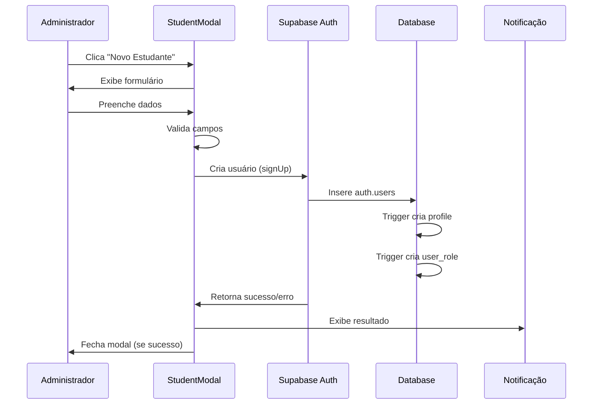

# Documento de Design

## Visão Geral

A funcionalidade "Novo Estudante" permitirá que administradores criem contas de estudantes diretamente através do painel administrativo. O sistema utilizará a API Admin do Supabase para criar usuários, gerará senhas temporárias seguras e fornecerá feedback adequado sobre o processo.

## Arquitetura

### Fluxo de Dados



### Estrutura de Componentes

```
AdminDashboard
├── StudentModal (novo)
│   ├── StudentForm
│   ├── PasswordDisplay
│   └── ValidationMessages
└── StudentList (existente)
```

## Componentes e Interfaces

### 1. StudentModal Component

**Props Interface:**
```typescript
interface StudentModalProps {
  isOpen: boolean;
  onClose: () => void;
  onSuccess: () => void;
}
```

**Estado Interno:**
```typescript
interface StudentFormData {
  fullName: string;
  email: string;
  studentRegistration: string;
}

interface StudentModalState {
  formData: StudentFormData;
  isLoading: boolean;
  errors: Record<string, string>;
  generatedPassword: string | null;
  showCredentials: boolean;
}
```

### 2. Validation Service

**Funções de Validação:**
```typescript
interface ValidationResult {
  isValid: boolean;
  errors: Record<string, string>;
}

// Validações implementadas:
- validateEmail(email: string): boolean
- validateStudentRegistration(registration: string): boolean
- validateFullName(name: string): boolean
- checkEmailExists(email: string): Promise<boolean>
- checkRegistrationExists(registration: string): Promise<boolean>
```

### 3. Password Generator Service

**Geração de Senha Segura:**
```typescript
interface PasswordConfig {
  length: number;
  includeUppercase: boolean;
  includeLowercase: boolean;
  includeNumbers: boolean;
  includeSymbols: boolean;
}

// Função principal:
generateSecurePassword(config: PasswordConfig): string
```

**Critérios de Segurança:**
- Mínimo 12 caracteres
- Combinação de maiúsculas, minúsculas, números e símbolos
- Evitar caracteres ambíguos (0, O, l, I)
- Garantir pelo menos um caractere de cada tipo

## Modelos de Dados

### 1. Estrutura do Formulário

```typescript
interface NewStudentData {
  fullName: string;        // Obrigatório, min 2 caracteres
  email: string;           // Obrigatório, formato válido, único
  studentRegistration: string; // Obrigatório, formato específico, único
}
```

### 2. Resposta da Criação

```typescript
interface CreateStudentResponse {
  success: boolean;
  user?: {
    id: string;
    email: string;
    temporaryPassword: string;
  };
  error?: string;
}
```

### 3. Integração com Supabase

**Tabelas Afetadas:**
- `auth.users` - Criação do usuário de autenticação
- `public.profiles` - Perfil do estudante (via trigger)
- `public.user_roles` - Role de estudante (via trigger)

**Triggers Existentes:**
- `on_auth_user_created` - Cria automaticamente profile e role

## Tratamento de Erros

### 1. Categorias de Erro

**Erros de Validação:**
- Email inválido ou já existente
- Matrícula inválida ou já existente
- Nome muito curto ou inválido

**Erros de Sistema:**
- Falha na conexão com Supabase
- Erro na criação do usuário
- Erro na geração de senha

**Erros de Permissão:**
- Usuário não é administrador
- Sessão expirada

### 2. Estratégias de Tratamento

```typescript
interface ErrorHandling {
  validation: {
    showInline: boolean;      // Erros nos campos
    preventSubmit: boolean;   // Bloquear envio
  };
  system: {
    showToast: boolean;       // Notificação de erro
    logError: boolean;        // Log para debugging
    retryOption: boolean;     // Permitir nova tentativa
  };
  permission: {
    redirectToAuth: boolean;  // Redirecionar para login
    showUnauthorized: boolean; // Mensagem de não autorizado
  };
}
```

## Estratégia de Testes

### 1. Testes Unitários

**Componentes:**
- StudentModal rendering e interações
- Validação de formulário
- Geração de senhas

**Serviços:**
- Funções de validação
- Gerador de senhas
- Integração com Supabase

### 2. Testes de Integração

**Fluxos Completos:**
- Criação bem-sucedida de estudante
- Tratamento de erros de validação
- Tratamento de erros de sistema
- Atualização da lista após criação

### 3. Testes E2E

**Cenários Principais:**
- Admin cria estudante com dados válidos
- Admin tenta criar estudante com email duplicado
- Admin tenta criar estudante com matrícula duplicada
- Verificação de credenciais geradas

## Considerações de Segurança

### 1. Validação de Permissões

```typescript
// Verificação antes de permitir criação
const canCreateStudent = async (userId: string): Promise<boolean> => {
  const { data } = await supabase.rpc('has_role', {
    _user_id: userId,
    _role: 'admin'
  });
  return data === true;
};
```

### 2. Sanitização de Dados

- Trim em todos os campos de texto
- Validação de formato de email
- Escape de caracteres especiais
- Validação de comprimento de campos

### 3. Geração Segura de Senhas

- Uso de crypto.getRandomValues() para aleatoriedade
- Evitar padrões previsíveis
- Não armazenar senhas em plain text
- Forçar alteração no primeiro login

## Considerações de UX

### 1. Feedback Visual

**Estados do Modal:**
- Loading durante criação
- Sucesso com credenciais
- Erro com mensagens específicas
- Validação em tempo real

### 2. Acessibilidade

- Labels apropriados para screen readers
- Navegação por teclado
- Contraste adequado
- Mensagens de erro descritivas

### 3. Responsividade

- Modal adaptável a diferentes tamanhos de tela
- Formulário otimizado para mobile
- Botões com tamanho adequado para touch

## Implementação Técnica

### 1. Estrutura de Arquivos

```
src/
├── components/
│   ├── admin/
│   │   ├── StudentModal.tsx
│   │   ├── StudentForm.tsx
│   │   └── CredentialsDisplay.tsx
│   └── ui/ (componentes existentes)
├── services/
│   ├── studentService.ts
│   ├── validationService.ts
│   └── passwordService.ts
├── hooks/
│   └── useStudentCreation.ts
└── types/
    └── student.ts
```

### 2. Dependências Necessárias

**Existentes (já no projeto):**
- @supabase/supabase-js
- react-hook-form
- zod (para validação)
- lucide-react (ícones)

**Novas (se necessário):**
- crypto-js (para geração de senhas mais robusta)

### 3. Configuração do Supabase

**RLS Policies Necessárias:**
- Admins podem criar usuários
- Admins podem ler todos os profiles
- Verificação de duplicatas

**Funções SQL Adicionais:**
```sql
-- Função para verificar email duplicado
CREATE OR REPLACE FUNCTION check_email_exists(_email TEXT)
RETURNS BOOLEAN AS $$
BEGIN
  RETURN EXISTS (
    SELECT 1 FROM auth.users WHERE email = _email
  );
END;
$$ LANGUAGE plpgsql SECURITY DEFINER;

-- Função para verificar matrícula duplicada
CREATE OR REPLACE FUNCTION check_registration_exists(_registration TEXT)
RETURNS BOOLEAN AS $$
BEGIN
  RETURN EXISTS (
    SELECT 1 FROM public.profiles WHERE student_registration = _registration
  );
END;
$$ LANGUAGE plpgsql SECURITY DEFINER;
```